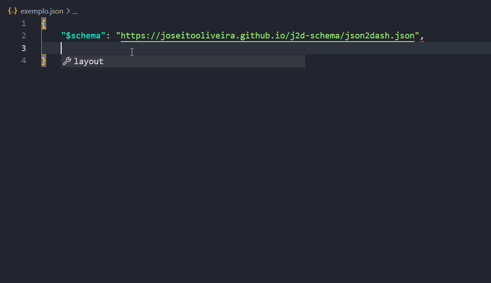

# Como usar:
Crie um arquivo .json e adicione a chave "$schema" com o valor "https://joseitooliveira.github.io/j2d-schema/json2dash.json"
```
{
    "$schema":"https://joseitooliveira.github.io/j2d-schema/json2dash.json"
}
```
A partir desse ponto, esse arquivo JSON já segue o esquema do json2dash e o intellisense do VS Code te ajudará.

